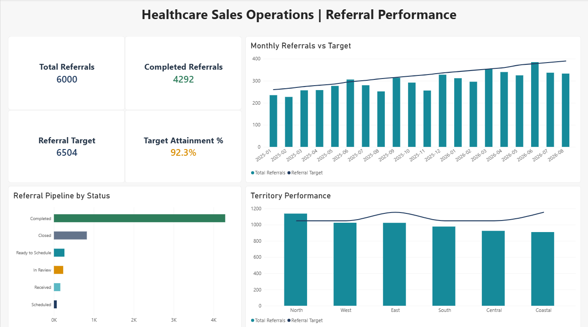
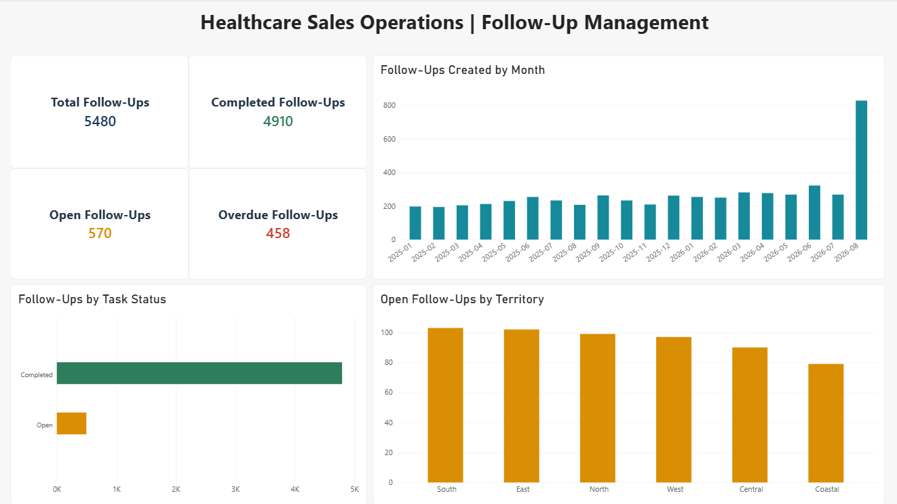
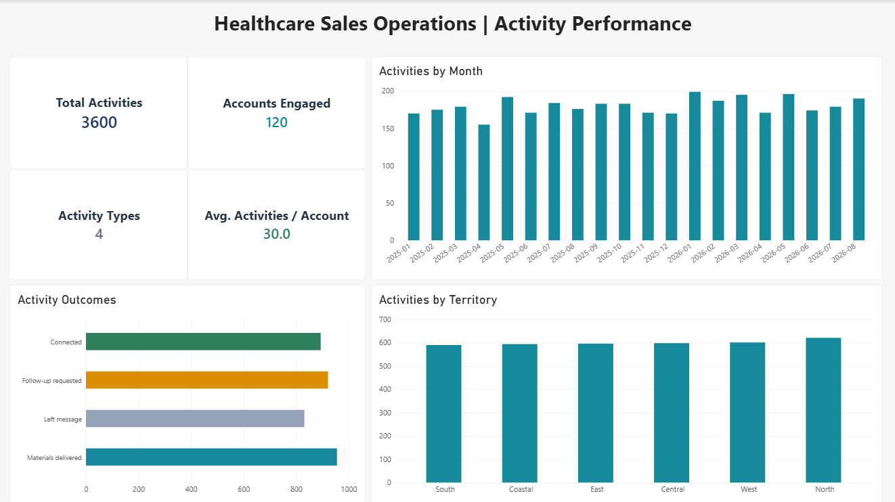

# Healthcare Sales Operations: Referral Performance & Workflow Improvement

**Independent case study | Synthetic portfolio data | SQL + Power BI + operational playbook**

Project owner: Lisa A. Phillips  
Version: 1.0 — local Power BI Desktop report completed; formal UAT and Power BI Service publishing remain out of scope  
Scenario organization: **Juniper Ridge Outpatient Care**, a fictional portfolio organization  
Snapshot: **August 31, 2026** | Source receipts: January 1, 2025–August 31, 2026

## What this case study demonstrates

This case study demonstrates the ability to:

- Build a structured reporting model from fragmented operational intake records.
- Clean, normalize, and classify referral statuses, payer groups, service lines, ownership fields, and scheduling outcomes.
- Frame business questions and KPIs around referral volume, follow-up workload, territory performance, and outreach activity.
- Build a three-page Power BI Desktop report for referral performance, follow-up management, and activity performance.
- Document the data model, SQL transformations, validation evidence, workflow recommendations, and report previews in a recruiter-ready repository.

## Included deliverables

- A complete GitHub repository with source data, SQL, scripts, validation evidence, project documentation, and report previews.
- A case-study narrative in the README and supporting documentation.
- A local Power BI Desktop `.pbix` report with three completed report pages. The file remains local because it is too large for a standard Git repository.
- GitHub-friendly report screenshots in `docs/screenshots/`.
- A PowerPoint leadership briefing and an existing project brief PDF.

This project uses synthetic data. It does not claim production deployment, published Power BI Service access, formal user acceptance testing, clinical outcomes, or financial impact.

## The business problem

Where are referrals delayed or failing to progress, which partner accounts need attention, and what should sales and intake operations change?

This project separates referral volume, 30-day cohort scheduling, and the current intake work queue. The process ends at the first completed appointment or an administrative closure. It does not represent an employer, actual patient records, clinical treatment decisions, or industry performance benchmarks.

## Start here

Read `START_HERE.md`, then `docs/Project_Brief.pdf`. The reporting inputs are already available in `data/processed`, and the working SQLite database is in `database`. No server setup is required to inspect the supplied SQLite file.

## Demonstrated technical result — not a real-world outcome

The synthetic export has **6,300 rows but 6,000 unique referrals**. Counting rows would overstate referrals by **5.0% relative to the unique-referral baseline**. The SQL preserves every raw row, selects one source version per referral, and flags the repeated IDs. The 300 excess rows are 4.76% of raw rows; that is a different denominator.

The pipeline also identifies **78 referrals with unusable timing data**, preserving them for review rather than silently dropping them. The valid mature scheduling cohort contains **5,602 referrals**, of which **4,024 (71.8%)** were booked within 30 calendar days. These are computed characteristics of deliberately constructed data, not discoveries about a real healthcare organization.

**40 automated SQL/data checks passed** in the supplied build. The Power BI Desktop report has been built and visually reviewed locally. It has not been published to the Power BI Service, and formal user acceptance testing remains outside this portfolio case study. See `tests/build_log.json`, `tests/validation_results.csv`, and `tests/sql_baseline.csv`.

## Scope and planned report

| Page | Decision |
|---|---|
| Referral Performance | Track referral volume, completion status, monthly targets, and territory performance. |
| Follow-Up Management | Monitor open and overdue follow-ups, monthly workload, and territory concentration. |
| Activity Performance | Review outreach volume, account engagement, recorded outcomes, and territory coverage. |

The organization contains 120 synthetic partner accounts, 6 territories, 8 sites, 12 sales representatives, and 8 intake owners. Unknown-owner dimension members are retained separately.

## Repository contents

| Location | Purpose |
|---|---|
| `docs/` | Brief, requirements, KPI/data dictionary, workflow playbook, draft leadership memo |
| `docs/screenshots/` | Final Power BI report previews for GitHub review |
| `data/raw/` | Original synthetic source exports, including intentional defects |
| `sql/` | Raw schema, source profiling, transformations, business-analysis queries |
| `scripts/` | Deterministic data generator, SQL runner, independent validation |
| `database/` | Ready-to-open SQLite database with raw and reporting layers |
| `data/processed/` | Twelve SQL-prepared Power BI import tables |
| `powerbi/` | Model relationships, page specifications, and starter DAX |
| `tests/` | Injection manifest, automated evidence, SQL baseline, manual UAT checklist |

## Power BI report previews

The Power BI Desktop `.pbix` file stays local because it is too large for a standard Git repository. These previews show the completed report pages.

### Referral Performance



### Follow-Up Management



### Activity Performance



## Reproduce the working build

Requires Python 3.10+ with standard-library SQLite 3.25+; no pip packages required for the data pipeline. From the extracted project directory:

```bash
python scripts/build_project.py
```

On Windows, `py` may be the command for the Python launcher:

```powershell
py scripts/build_project.py
```

This reads existing raw CSVs and rebuilds the generated database, reporting exports, and SQL test evidence. It does not overwrite the raw data. To intentionally replace the raw synthetic data with the fixed-seed generator output:

```bash
python scripts/build_project.py --regenerate
```

The optional `--regenerate` flag overwrites only this project's synthetic raw CSVs and generation manifest. Do not point the scripts at real healthcare data. The schema file is generated from the source headers. On a fresh database, `00_schema.sql` defines raw tables; the runner handles CSV loading before executing `02_build_reporting.sql`. Do not execute the CREATE TABLE transformation script against an already-built database without rebuilding it first.

## Measurement and ethics

All time calculations use date-only **calendar days**, not business hours. The 2-day follow-up and 7-day stalled-stage rules are project assumptions, not regulatory deadlines. The 30-day metric measures **booking within 30 days of receipt**, not attendance within 30 days. Mature canceled/closed referrals remain in its denominator; referrals without valid timing data are excluded with an explicit count.

Sales-account ownership and intake-case ownership are different fields. Missing owners are not inferred. A single referral can have several data-quality exceptions. Event history determines report stage provisionally; status disagreements are still reviewed. One referral has at most one first booking and one first completed visit in this simplified version; rescheduling and repeated treatment visits are out of scope.

Do not claim that the proposed workflow increased appointments, improved clinical outcomes, or saved employer money. Those claims would require a real implementation and a suitable evaluation. AI assisted the starter data, code, and documentation; the project owner should review, adapt, reproduce, and explain the work before presenting it as a completed portfolio case study.

## Reference context

The case study is independent. Employer postings informed the skill themes, not the synthetic data or assumptions. Retrieved September 30, 2026:

- IVX Health, Manager, Sales Operations: https://job-boards.greenhouse.io/ivxhealth/jobs/4290169009
- Cognizant, Healthcare Communications Consultant: https://careers.cognizant.com/us-en/jobs/00070471711/healthcare-communications-consultant-medicare-commercial-health-plans/
- SQLite window functions: https://www.sqlite.org/windowfunctions.html
- Microsoft Power BI star schema: https://learn.microsoft.com/en-us/power-bi/guidance/star-schema

No GitHub repository has been created or changed by this local starter build. No report has been published.
